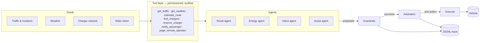
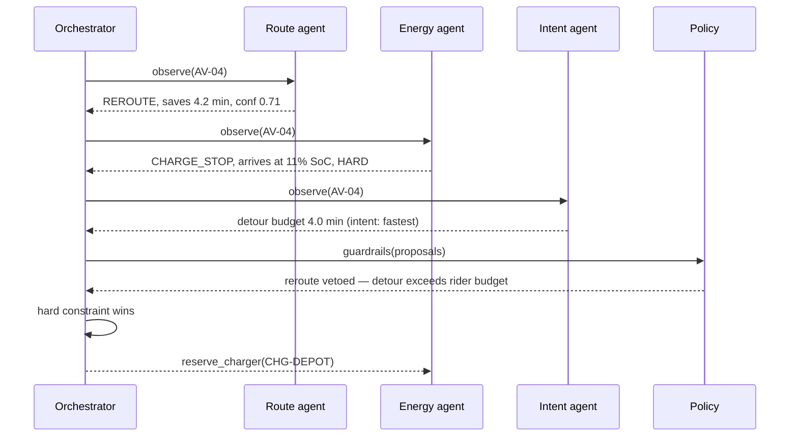

# Fleet Agents

**Cloud-to-vehicle coordination for autonomous fleets.** A multi-agent engine that decides, every two minutes and for every vehicle, whether to reroute around traffic, divert to a charger, message the rider, or hand control to a remote operator — and records why.

Pure Python, no dependencies, deterministic and replayable. `python -m fleetagents.cli simulate` runs a full evening-peak scenario in under a second.

---

## The problem

A robotaxi fleet gets conflicting advice constantly. Traffic says take the detour. Energy says you won't make it without a charge stop. The rider paid for the fast option and didn't sign up for either. Safety says a human should look at this one.

Something has to arbitrate, in real time, per vehicle, and afterwards you have to be able to explain what it decided and why. That arbitration layer is what this repo is.

## How it works

Four specialist agents observe the vehicle and return **proposals**. They never mutate state. The orchestrator applies guardrails, arbitrates, and executes exactly one action. Every step lands in a JSONL trace.



| Agent | Charter | Can call |
|---|---|---|
| **Route** | Keep the vehicle on the fastest safe corridor. Scans ahead along the path, not just around the vehicle. | traffic, weather, route estimates |
| **Energy** | Never arrive below reserve. Book the cheapest stop that holds that. | weather, chargers, reservations |
| **Intent** | Speak for the rider: detour tolerance, comfort, being told first. | weather, passenger messaging |
| **Assist** | Escalate early and cheaply. A handoff costs less than a stuck vehicle. | traffic, weather, teleop paging |

### Arbitration

```
hard constraints first        energy below reserve, severe blockage → wins outright
then highest utility × confidence
ties and zero-utility         → no action, vehicle continues
```

Guardrails run *before* arbitration and veto with a written reason: confidence below the floor, reroute limit reached, detour exceeding the rider's tolerance, or an action still inside its cooldown. Vetoes are recorded, not silently dropped — a decision you can't audit is a decision you can't ship.



## Quickstart

```bash
git clone https://github.com/vivekselvakumar/fleet-agents.git
cd fleet-agents
PYTHONPATH=src python -m fleetagents.cli simulate --vehicles 10 --minutes 90 --explain
```

No install, no dependencies, Python 3.9+. Or `pip install -e .` and use the `fleetagents` command.

```
  [16:22] AV-04: charge_stop on the energy agent's call (utility 12.0, confidence 0.92).
          Projected arrival 11% SoC. Stop at CHG-DEPOT (350 kW): +3.7 min detour, 9 min plugged in.
  [16:28] AV-07: holding course. Policy vetoed reroute: confidence 0.38 below floor 0.45.
  [16:34] AV-06: handoff on the assist agent's call (utility 8.0, confidence 0.88).
          Remote operator review: crawling at 9 kph beside collision blocking two lanes.

KPIs
  trips              10
  completed          10
  on_time_pct        60.0
  avg_detour_min     0.76
  reroutes           1
  charge_stops       3
  handoffs           1
  policy_vetoes      21
```

Useful flags: `--seed` for reproducibility, `--trace traces/run.jsonl` to write the audit log, `--min-confidence` to tighten or loosen the escalation threshold, `--json` for machine-readable KPIs.

## Does the agent stack earn its keep?

`PYTHONPATH=src python examples/compare_policies.py` — same scenarios, three configurations, mean over six seeds:

| config | on-time % | avg trip | avg end SoC | **stranded** | reroutes | charge stops | handoffs |
|---|---|---|---|---|---|---|---|
| baseline (no agents) | 81.7 | 22.3 min | 0.462 | 1 | 0 | 0 | 0 |
| route-only | 81.7 | 22.3 min | 0.462 | 1 | 0.2 | 0 | 0 |
| full stack | 50.0 | 30.4 min | 0.692 | **0** | 0.5 | 3.7 | 3.7 |

The full stack is *slower*. That is the finding, not a bug: charge stops and operator handoffs cost about eight minutes a trip and thirty points of on-time performance, and they buy zero stranded vehicles and a fleet that ends the shift at 69% charge instead of 46%. A stranded robotaxi is a recovery truck, a refund and a news story; a late one is a late one. The tradeoff is explicit in `Policy`, so you can price it differently.

## Design notes

**Proposals, not mutations.** Agents return intent; only the orchestrator writes. The diff between what was proposed and what was applied is the audit trail.

**Permissioned tools.** Each tool declares which agents may call it — the route agent physically cannot reserve a charger. Every call is logged with arguments and outcome. Swapping the simulated feeds for real APIs means rewriting `tools.py` and nothing else.

**Confidence as an escalation signal.** Agents lower their own confidence when the picture is messy — a severe incident compounded by a storm. Below the policy floor, the decision goes to a human instead of being taken badly. That is the whole remote-assistance trigger, in one number.

**Cooldowns.** Without them an agent re-decides the same condition every tick and the rider gets six identical texts. Each action carries a per-vehicle cooldown.

**Determinism.** Same seed, same run, every time. Tests assert it. You can diff two traces and see exactly which decision diverged.

**LLM optional, never load-bearing.** `llm.py` will have a model write the operator-facing narrative if `FLEET_LLM=anthropic` and a key are set. Control flow never depends on it. The model explains; the policy decides.

## Layout

```
src/fleetagents/
  domain.py        vehicles, trips, rider intent, geography
  world.py         seeded simulation: traffic, weather fronts, incidents, chargers
  tools.py         permissioned, audited tool layer — the seam to real APIs
  agents/          route, energy, intent, assist
  orchestrator.py  guardrails, arbitration, execution
  telemetry.py     JSONL traces
  llm.py           optional narration
  cli.py           simulate
tests/             15 tests, stdlib unittest, no deps
examples/          policy comparison, storm scenario
docs/              architecture notes
```

## Extending it

Adding an agent is one file: subclass `Agent`, declare a name, return proposals. Add the name to the `allowed_agents` list of any tool it needs.

```python
class CurbAgent(Agent):
    name = "curb"
    charter = "Find a legal, reachable place to actually stop."

    def propose(self, vehicle, context):
        traffic = self.call("get_traffic", point=vehicle.position)
        if traffic.data["congestion"] > 0.8:
            return [Proposal(self.name, Action.HOLD,
                             "No safe curb space in this block.",
                             utility=3.0, confidence=0.7)]
        return []
```

Obvious next steps: real road graph instead of straight-line sampling, multi-vehicle assignment and pooling, charger contention across the whole fleet rather than first-come, and replaying a trace into a dashboard.

## Tests

```bash
PYTHONPATH=src python -m unittest discover -s tests -t .
```

Covers determinism, tool permissions, the energy reserve floor, rider detour budgets, hard-constraint precedence, veto reasons, the handoff path, and two full-fleet runs asserting no vehicle ever strands at zero charge.

## License

MIT
